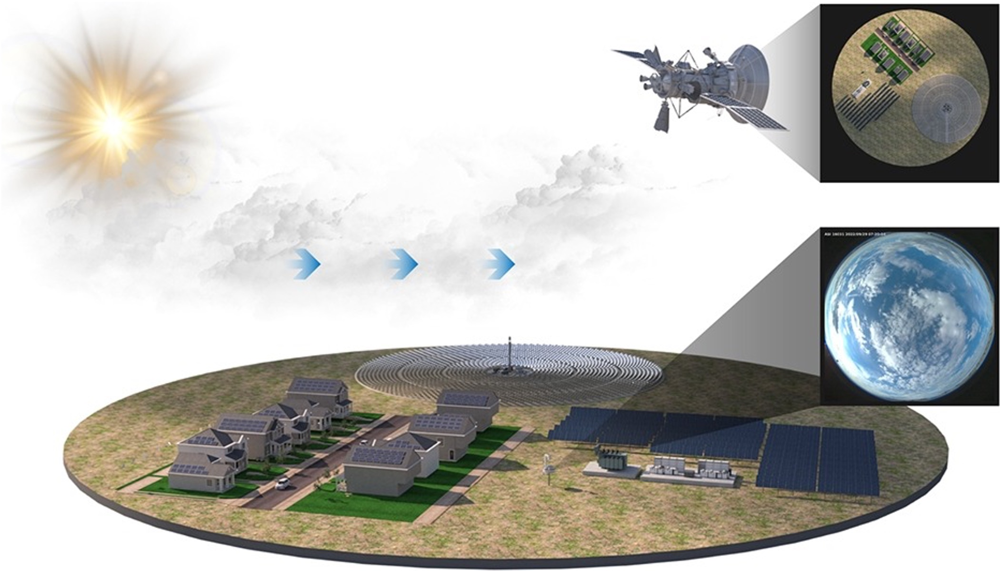

# CloudGaze

Landsat Sky Image based Determination of Cloud Motion to Predict Solar Obscuration  



## Project Overview 
The detection and prediction of cloud motion from ground based visible light images are critical for optimizing solar energy generation and improving solar facility yield predictions. Moreover, understanding cloud dynamics provides valuable insights for climate modeling.
**CloudGaze** is a cloud motion detection and prediction system designed to analyze the movement of clouds using LandSat images. The project applies image segmentation techniques, motion detection algorithms, and predictive modeling to assess potential sun coverage and forecast cloud movement.

## Features  
- **Cloud and Sun Detection:** Binary segmentation of clouds and sun regions from Landsat sky images.  
- **Optical Flow Analysis:** Lucas-Kanade algorithm to track cloud motion vectors.  
- **Centroid Calculation:** Identifies largest cloud and sun positions for spatial analysis.  
- **Predictive Modeling:** Estimates cloud motion and sun coverage probabilities using a Kalman filter.   
- **Real-Time Processing:** Periodic image capture using an RPi camera module for dynamic cloud tracking.


## You can get the paper from:
[Paper and Poster](https://drive.google.com/drive/folders/17PPVxA6rgk40WpDEWhJqYYWTZ_OpCGi2?usp=drive_link)

## References

- S. Dev, Y. H. Lee, S. Winkler. **Color-based segmentation of sky/cloud images from ground-based cameras**. *IEEE Journal of Selected Topics in Applied Earth Observations and Remote Sensing*, vol. 10, no. 1, pp. 231-242, January 2017 (Dataset)
- Pekko Tuominen, Minttu Tuononen; Cloud detection and movement estimation based on sky camera images using neural networks and the Lucas-Kanade method. AIP Conf. Proc. 27 June 2017; 1850 (1): 140020 (Root Method)

 ## 1. Install Miniconda and Requirements

### Download CloudGaze Repository
```bash
git clone https://github.com/weijithw2022/CloudGaze.git
cd CloudGaze
```

### Install to "ml_base" Virtual Environment
```bash
conda env create -f environment.yaml
conda activate ml_base
```
 ## 2. Download the dataset
 
[Google Drive Link](https://drive.google.com/file/d/1M7_Cnm79XJ7fVagPmRALkzF5Hbb5ypc-/view?usp=drive_link)

 ## 3. Run the code
 ```bash
python src/version1.py
```


## Project Structure  
```plaintext
CloudGaze/
├── data/
│   ├── filtered/          
│   ├── followed/
│   ├── movement/
│   ├── predicted/
│   ├── presentation/
│   ├── processed/
│   ├── saved/
│   ├── segmented/
│   │   └── thresholded/
├── src/     
│   ├── version1.py   
│   ├── kalmanfilter.py
│   ├── models/
│   │   ├── network.py
│   │   ├── loss.py           
│   ├── temp/
│   │   ├── avgvector.py
│   │   ├── contours.py
│   │   ├── filterbrightmask.py
│   │   ├── findcentroid.py
│   │   ├── imagecap.py
│   │   ├── largestcontour.py
│   │   ├── lucasKanademodel.py
│   │   ├── lucasKanadethresholded.py                     
├── models/            
└── README.md


```

